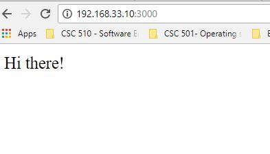

## Steps to create a Virtual Machine using vagrant and virtualbox
1. Open cmd/terminal.For Windows, make sure you run the cmd window as administrator. Make a new directory **HW0** and inside this directory, make two additional directories - **dev** and **vm1**. The 'dev' folder as the synced folder in the host OS.The 'vm1' folder will be used to store all the files created by vagrant while creating a new VM.  
2. Go inside the vm1 folder and perform the following steps:  
i.  **vagrant init ubuntu/trusty64**  
ii. **Edit the [Vagrantfile](https://github.ncsu.edu/nsakhal/HW0/blob/master/Vagrantfile)** to configure the IP address(192.168.33.10) for vm1 and to configure the synced folder with the host OS.    
  Path of Synced folder in host OS: F:/CSC519_DevOps/Homeworks/HW0/dev  
  Path of Synced folder in vm1: /home/vagrant/synced_folder  
iii. **vagrant up**  
iv. **vagrant ssh** - Now you will be logged into vm1 machine.  
v. Inside vm1 machine, perform the following steps to install nodejs in vm1:  
-sudo apt-key adv --keyserver keyserver.ubuntu.com --recv 68576280  
-sudo apt-add-repository "deb https://deb.nodesource.com/node_7.x $(lsb_release -sc) main"  
-sudo apt-get update  
-sudo apt-get install nodejs  
-sudo apt-get install git  
Go inside the '**synced_folder**' present in vm1 machine and then perform the below steps:  
Clone the ComputingEnvironmentWorkshop repo:  
-git clone https://github.com/chrisparnin/ComputingEnvironmentsWorkshop.git  
-cd ComputingEnvironmentsWorkshop/projects/express/  
-npm install  
-npm run forever  
vi. Open a web browser in the host OS and type 192.168.33.10:3000. The following webpage will be displayed:   
The above screenshot indicates that node.js is properly installed on vm1 and also that forever is running on vm1

