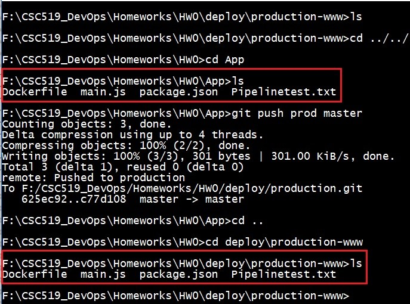
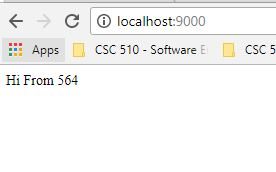

## Steps to create a barebone pipeline consisting of hooks
1. Git clone the [App](https://github.com/CSC-DevOps/App.git) repository inside **HW0** folder
2. Outside the **App** folderm make a new directory **deploy**. Inside this directory, create two additional directories - **production.git** and **production-www**.  
3. Go inside the **deploy/production.git** folder and perform the following steps:  
-**git init --bare**  
-Go inside the **hooks** folder present inside the **deploy/production.git** folder and create a new file - [post-receive](https://github.ncsu.edu/nsakhal/HW0/blob/master/post-receive). Change the file permissions using **chmod +x post-receive** command in Unix Systems.  
4. Go inside the **App** folder and perform the following steps:  
-git remote add prod F:/CSC519_DevOps/Homeworks/HW0/deploy/production.git  
Now create a simple commit using the following steps:   
-touch Pipelinetest.txt  
-git add Pipelinetest.txt  
-git commit -m "Testing the barebone pipeline"  
Now push the changes done in App repository into production using the command:  
-git push prod master  
5. Now, if we go inside the **deploy/production-www** folder, we will see all the files present in the App repository inside this folder.  
The below screenshot demonstrates the pipeline:
  
6. Inside the  **deploy/production-www** folder, perform the following steps:  
-npm install  
-node main.js 9000  
7. Open the web browser in the host OS and type localhost:9000/ to view the app we just deployed in the production.The screenshot attached below shows the output of the webpage:  
  

